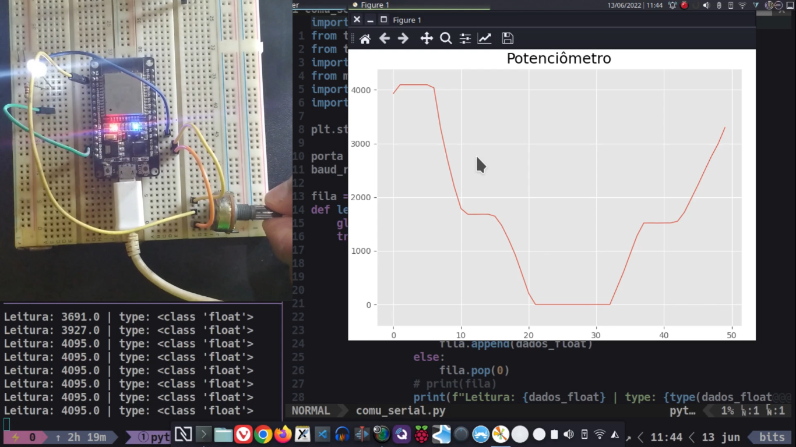

# Grafico Dinâmico da Tensão de um Potenciômetro

Esse projeto visa ler a tensão de um potenciômetro em tempo real com o auxílio do converso ADC de uma placa Esp32 DevKit V1 e se comunicar com um computador através da porta Serial USB.

No Computador será capturado esses dados usando o código em Python e tratado para plotar o gráfico da tensão em tempo real.

<iframe width="560" height="315" src="https://www.youtube.com/embed/9hH7i2n7ohQ" title="YouTube video player" frameborder="0" allow="accelerometer; autoplay; clipboard-write; encrypted-media; gyroscope; picture-in-picture" allowfullscreen></iframe>

